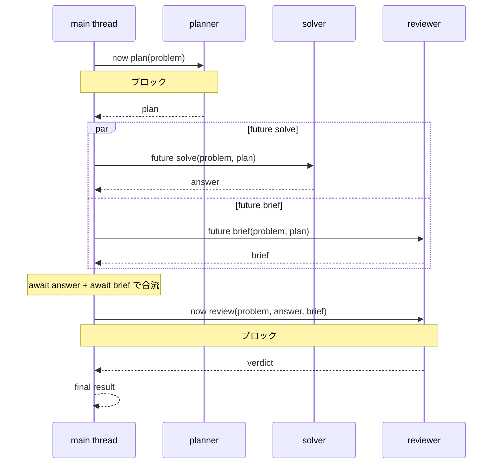

# Future Message Timeline Chart

作成日: 2026-05-03

対象サンプル:

```sh
sh scripts/run_future_timeline_ja.sh
```

## Sequence



## Timeline

```mermaid
gantt
    title future型メッセージ送信タイムライン
    dateFormat  X
    axisFormat %Lms

    section main thread
    now planner.plan を待つ          :active, main_plan, 0, 500
    future x2 を送信                 :milestone, main_send, 500, 0
    await answer/brief で合流        :active, main_await, 500, 2000
    now reviewer.review を待つ       :active, main_review, 2500, 500
    final result                     :milestone, main_done, 3000, 0

    section planner
    plan                             :planner_plan, 0, 500

    section solver
    solve                            :solver_solve, 500, 2000

    section reviewer
    brief                            :reviewer_brief, 500, 2000
    review                           :reviewer_review, 2500, 500
```



## Concept

```text
時刻 →

              ┌─ planner ───────────────► plan
main thread ──┤
              │                 ┌─ solver ─────────► answer
              │                 ├─ reviewer.brief ─► brief
              └─ now plan ──────┴─ future x2 ─────── await x2 ──┬─ now reviewer.review ─► verdict
                 ブロック          ノンブロック        合流       ブロック

並列度:
  solver.solve と reviewer.brief は同時に動く。
  サンプルではそれぞれ wait(2000.) なので、逐次なら約4秒の区間が約2秒になる。
```

## Observed Event Order

実行ログでは次の順でイベントが出る。

```text
main.start
planner.start
planner.done
main.after_now_plan
main.future_sent:solver+reviewer.brief
reviewer.brief.start
solver.start
reviewer.brief.done
solver.done
main.await_answer
main.await_brief
reviewer.review.start
reviewer.review.done
main.after_now_review
```

`reviewer.brief.start` と `solver.start` が `main.future_sent` の後に並んでおり、
両方が完了してから `main.await_answer` / `main.await_brief` に進む。
